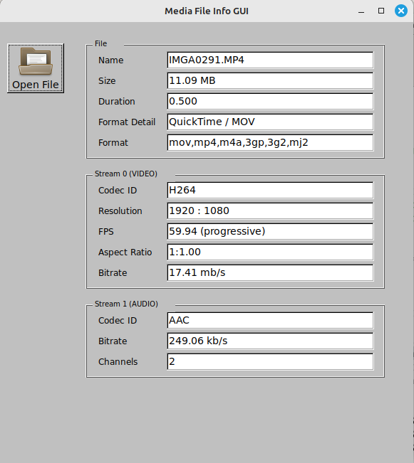

# go-mediafileinfo-gui 

A Go program that lets you inspect media files for audio and video properties, built on [go-fltk](https://github.com/archeopternix/go-fltk).

## Purpose

This program provides a graphical user interface (GUI) for viewing metadata
of media files such as MP4, AVI, MOV, and more. Users can select one
video file, and the application will display detailed information including
file size, duration, format, codec details, resolution, frame rate, aspect ratio,
bitrate, and audio channels. The GUI is built using go-fltk, and metadata is displayed
in a table format using gofltk-keyvalue.
Author: archeopternix

## Repository

https://github.com/archeopternix/go-mediafileinfo-gui

## License

MIT